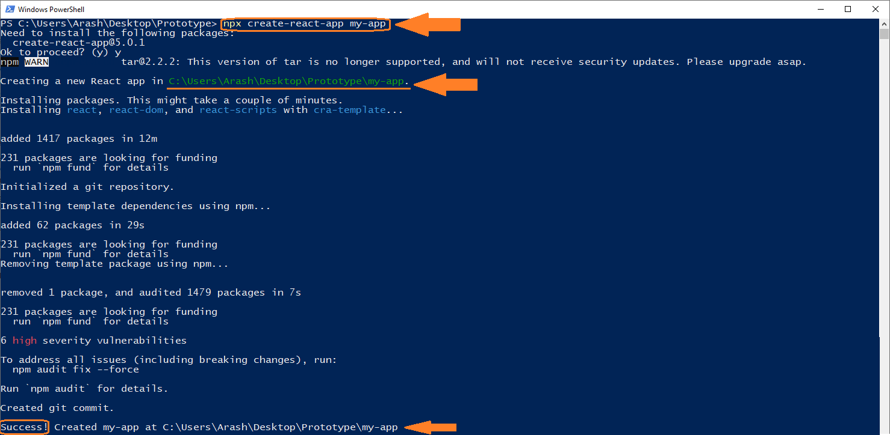
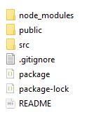
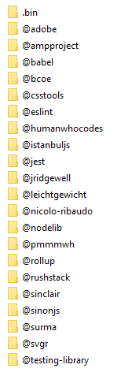
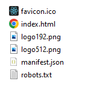
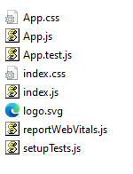
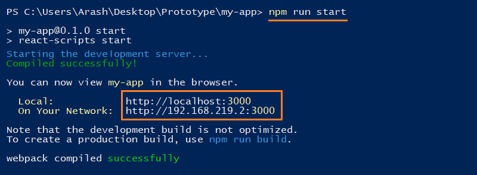
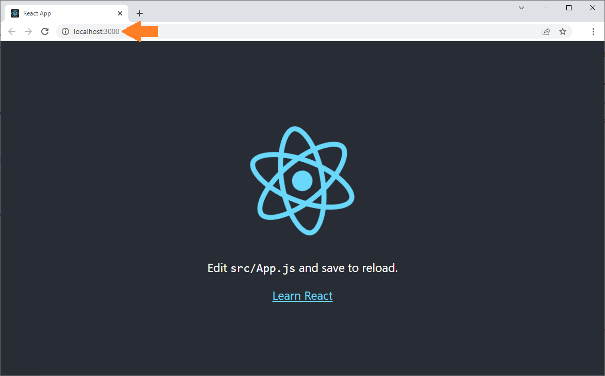

# فصل 1. معرفی ری اکت `Getting started with ReactJS`

کتابخانه React یکی از کتابخانه های متن باز جاوا اسکریپت می باشد که وظیفه مدیریت وب سایت سمت کاربر ( Front-End ) را با استفاده از تکنیک `Single-Page Application (SPA)` دارد. باتوجه به استفاده رو به رشد سازمان ها از این کتابخانه، فضای بسیار مناسبی برای فعالیت برنامه نویسان در داخل و خارج از کشور فراهم شده است.

## کتابخانه React چیست؟

کتابخانه React در سال 2013 توسط شرکت متا به صورت `Open Source` به زبان جاوا اسکریپت روی [گیت هاب](https://github.com/facebook/react) منتشر شد. React وظیفه مدیریت UI سمت کاربر را دارد. از جمله وظایف این کتابخانه می توان به موارد ذیل اشاره کرد:

- مدیریت کدهای HTML, CSS
- مدیریت Routing بین صفحات
- مدیریت ارسال و دریافت اطلاعات بین کلاینت و سرور
- بهینه سازی ترافیک
- مدیریت فرم ها

> کتابخانه دیگری به نام React Native بر مبنای React توسعه داده شده که امکان برنامه نویسی برای تلفن های همراه را برای هر دو سیستم عامل َAndroid و IOS فراهم می کند.

### چرا React

هر ابزاری که امروزه به محبوبیت رسیده، طی گذر زمان در تلاش بوده که نقاط ضعف خودش را تبدیل به نقاط قوت کند.

### 1. بازار کار

به دلیل قدرت، انعطاف پذیری و سادگی برنامه نویسی با React، بسیاری از سازمان ها در داخل و خارج از کشور از این کتابخانه استفاده می کنند در نتیجه روز به روز نیاز به افراد ماهر در این حوزه بیشتر احساس می شود. کافیست شما در سایت های کاریابی داخلی یا برای فعالیت در خارج از کشور به linkedin یا indeed سر بزنید.

<p align="center">
 میانگین درآمد سالیانه ( بدون کسر مالیات ) - سال 2022
</p>


<div>
<table align="center">
<thead>
<tr>
<th align="center">Australia</th>
<th align="center">Canada</th>
<th align="center">United States</th>
</tr>
</thead>
<tbody>
<tr>
<td align="center">$120,000</td>
<td align="center">$84,000</td>
<td align="center">$100,000</td>
</tr>
</tbody>
</table>
</div>

### 2. سئو بهینه `SEO Friendly`

ری اکت `React` نسبت به سایر رقبا از جمله `Vue.js` و `Angular` تناسب بیشتری با ساختار SEO دارد در نتیجه موتورهای جستجو صفحات وب با دقت بیشتری بررسی می کنند.

### 3. ساختار کامپوننت محور `Component-based Architecture`

به واحد های مستقلی که از سایر بخش ها مجزاء هستند کامپوننت `Component` گفته می شود. به کمک `Component` ساختار صفحه به بخش های کوچکتری تقسیم می شود. از جمله فواید `Component-based Architecture`:

- افزایش سرعت توسعه نرم افزار
- افزایش سرعت عیب یابی نرم افزار
- کاهش در باز نویسی بخش های مشابه

### 4. جامعه فعال برنامه نویس

ری راکت `React` با توجه به محبوبیتی که بین برنامه نویسان دارد در صورتیکه به مشکل مواجه شوید افراد زیاد در سطح اینترنت پاسخگو سوالات شما هستند و همینطور کتابخانه های بسیاری برای تسهیل برنامه نویسی توسعه داده شده اند.

### 5. سادگی در یادگیری

ری اکت به دلیل سادگی در Syntax و ساختار بندی که دارد نسبت به سایر رقبا از جمله `Angular` و `Vue` به مراتب سادگی بیشتری در فهم و پیاده سازی ایده ها دارد.

## نصب پیش نیاز

برای شروع نیاز به nodejs و vscode داریم.

### نصب `node.js`


نود جی اس `node.js` ابزاری `cross-platform` می باشد که امکان اجرای دستورات جاوا اسکریپت را بروی سیستم عامل های مختلف فراهم می کند.

نسخه LTS از این [لینک دانلود](https://nodejs.org/en/download/) کنید.

### نصب `Visual Studio Code`


یکی از بهترین `IDE` های رایگان که شامل طیف وسیعی از افزونه ها می باشد. [لینک دانلود](https://code.visualstudio.com/download)

## ساخت پروژه 🧪

در محیط `Terminal` با ابزار `create-react-app` پروژه خامی به نام `my-app` ایجاد کنید.

```shell
npx create-react-app my-app
```

این ابزار تمام پکیج ها و فایل های موردنیاز اولیه به صورت خودکار نصب می کند.



بعد از اتمام موفقیت آمیز، فولدری به نام `my-app` شامل پکیج و فایل های موردنیاز ایجاد می شود.



```
my-app
├── node_modules
│
├── public
│   ├── favicon.ico
│   ├── index.html
│	├── logo192.png
│	├── logo512.png
│	├── manifest.json
│   └── robots.txt
│
├── src
│   ├── App.css
│   ├── App.js
│   ├── App.test.js
│   ├── index.css
│   ├── index.js
│   ├── logo.svg
│   └── reportWebVitals.js
│   └── setupTests.js
│
├── .gitignore
├── package.json
├── package-lock.json
└── README.md
```
### ساختار دایرکتوری `React`

**دایرکتوری `node_modules`**



دایرکتوری نصب تمام پکیج های `npm` می باشد. این پکیج ها در فایل `package.json` تعریف شده است.

> برای نصب مجدد پکیج ها، دستور ذیل در محیط Terminal اجرا کنید. 
>
> ```shell
> npm install
> ```
>
> 💡 دقت کنید، برای اجرای این دستور باید دایرکتوری Terminal در محل پروژه باشد.


**دایرکتوری `public`**



شامل تمام فایل های موردنیاز جهت دسترسی در سمت کلاینت (مرورگر کاربر) می باشد. فایل هایی که در این بخش قرار می گیرد شامل `index.html` و تصاویر، فونت، استایل، اسکریپت، ایکون و غیره می باشد.


**دایرکتوری `src`**



فایل های اصلی React که شامل کامپوننت ها، استایل ها `css` و اسکریپت ها می شود.


 **فایل `gitignore.`**

```
# See https://help.github.com/articles/ignoring-files/ for more about ignoring files.

# dependencies
/node_modules
/.pnp
.pnp.js

# testing
/coverage

# production
/build

# misc
.DS_Store
.env.local
.env.development.local
.env.test.local
.env.production.local

npm-debug.log*
yarn-debug.log*
yarn-error.log*
```

این فایل شامل دایرکتوری هایی می باشد که گیت نباید آن ها را `track` کند.


**فایل `package.json`**

```json
{
  "name": "my-app",
  "version": "0.1.0",
  "private": true,
  "dependencies": {
    "@testing-library/jest-dom": "^5.16.5",
    "@testing-library/react": "^13.4.0",
    "@testing-library/user-event": "^13.5.0",
    "react": "^18.2.0",
    "react-dom": "^18.2.0",
    "react-scripts": "5.0.1",
    "web-vitals": "^2.1.4"
  },
  "scripts": {
    "start": "react-scripts start",
    "build": "react-scripts build",
    "test": "react-scripts test",
    "eject": "react-scripts eject"
  },
  "eslintConfig": {
    "extends": [
      "react-app",
      "react-app/jest"
    ]
  },
  "browserslist": {
    "production": [
      ">0.2%",
      "not dead",
      "not op_mini all"
    ],
    "development": [
      "last 1 chrome version",
      "last 1 firefox version",
      "last 1 safari version"
    ]
  }
}
```

این فایل شامل موارد ذیل می باشد:

<ul dir="rtl" align="right">
	<li>
		<p>
			نام پکیج های نصب شده در
			<code>node_modules</code>
		</p>
	</li>
	<li>
		<p>
			دستورات لازم برای اجرای اپلیکیشن در فاز های مختلف مثل
			<code>start</code>
			,<code>build</code>
			,<code>test</code>
			,<code>eject</code>
		</p>
	</li>
	<li>
		<p>
			نام و نسخه اپلیکیشن
		</p>
	</li>
	<li>
		<p>
			تنظیمات ابزار
			<code>browserslist</code>
		</p>
	</li>
</ul>

> ابزار `browserslist` استایل ها را متناسب انواع مرورگر و دستگاه بهینه سازی می کند.


**فایل `package-lock.json`**

```
{
  "name": "my-app",
  "version": "0.1.0",
  "lockfileVersion": 3,
  "requires": true,
  "packages": {
    "": {
      "name": "my-app",
      "version": "0.1.0",
      "dependencies": {
        "@testing-library/jest-dom": "^5.16.5",
        "@testing-library/react": "^13.4.0",
        "@testing-library/user-event": "^13.5.0",
        "react": "^18.2.0",
        "react-dom": "^18.2.0",
        "react-scripts": "5.0.1",
        "web-vitals": "^2.1.4"
      }
    },
...
```

این فایل در زمان نصب پکیج ها ایجاد می شود و شامل نام، نسخه، مقدار `integrity`و لینک دانلود هر پکیج می باشد.


**فایل `README.md`**

```markdown
# Getting Started with Create React App

This project was bootstrapped with [Create React App](https://github.com/facebook/create-react-app).

## Available Scripts

In the project directory, you can run:

### `npm start`

Runs the app in the development mode.\
Open [http://localhost:3000](http://localhost:3000) to view it in your browser.

The page will reload when you make changes.\
You may also see any lint errors in the console.

...
```

شامل توضیحات کاملی درباره اپلیکیشن مثل نصب پیش نیاز ها و روش اجرای اپلیکیشن می شود.

### اجرای `React`

برای اجرای React روی سیستم شخصی دستور ذیل در محیط `Terminal` وارد کنید.

> 💡 دقت کنید، برای اجرای این دستور باید دایرکتوری Terminal در محل پروژه باشد.

```shell
npm run start
```



آدرس مشخص شده را در مرورگر خود وارد کنید.



پروژه React با موفقیت ایجاد شد. 🎉

