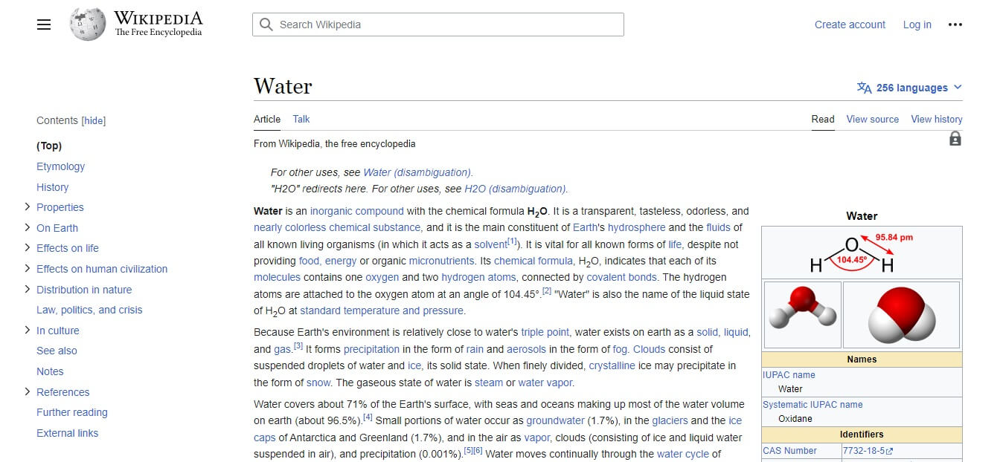
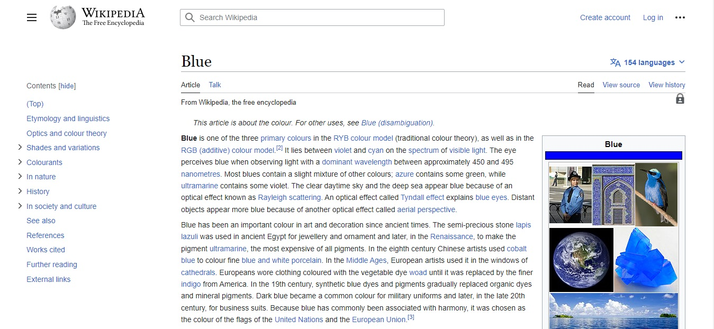
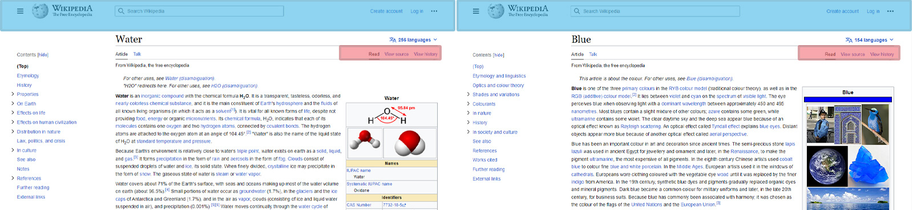
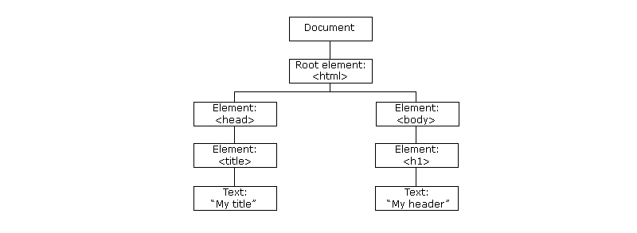
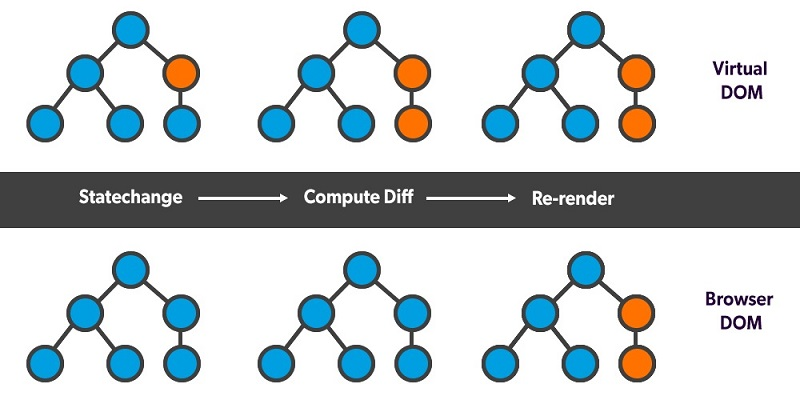

# فصل 2. ری اکت چطور کار می کند؟ `How React works`

کتابخانه React با استفاده از تکنیک SPA `Single Page Application` بار پردازشی برای بارگذاری صفحات از سمت سرور به سمت کلاینت منتقل کرده است.

## تکنیک `Single Page Application`


در روش سنتی در هر بار بازدید از صفحات وب سایت، وب سرور کل صفحه موردنظر برای کاربر ارسال می کرد. به این دو صفحه از سایت `Wikipedia` توجه کنید.



----



❔ چه بخش هایی از این دو صفحه مشابه هستند؟



بخش های آبی و قرمز در این دو صفحه مشابه هستند، در روش سنتی با اینکه این دو بخش یکسان هستند ولی مجدد بارگذاری می شوند!

* ترافیک بیشتر سمت سرور
* ترافیک بیشتر برای دانلود بخش های تکراری
* افزایش زمان رندرینگ مرورگر
* کاهش سرعت بارگذاری صفحات

به کمک تکنیک SPA `Single Page Application` جا به جایی بین صفحات از سمت وب سرور به سمت کلاینت منتقل می شود در نتیجه در کتابخانه React  بخش هایی که نیاز به بارگذاری از سمت سرور دارد قابل تعریف می باشد.


<h2 align="right">DOM</h2>

دام DOM `Document Object Model`،  ساختاری درختی از دستورات HTML می باشد که هر node شیء ای `Object` از DOM می باشد.



```html
<html>
	<head>
	    <title>My title</title>
	</head>
	<body>
	    <h1>My header</h1>
	</body>
</html
```

جاوا اسکریپت به کمک DOM امکان دسترسی به node های HTML را دارد بنابراین امکان ساخت، حذف و تغییر در هریک از node ها را فراهم می کند.

<h2 align="right">Virtual DOM</h2>




کتابخانه React به منظور افزایش سرعت و کاهش رم مصرفی، در بروزرسانی `node` ها، به جای استفاده از `DOM` از نسخه مجازی شده آن به نام `Virtual DOM` استفاده می کند. 

<h2 align="right">JSX</h2>

کتابخانه React دارای syntax اختصاصی به نام jsx `JavaScript XML` می باشد. به کمک jsx امکان کد نویسی HTML در قالب جاوا اسکریپت بسیار ساده تر می کند.

برای مثال دستور HTML ذیل را به دو روش با جاوا اسکریپت ایجاد می کنیم.

```html
<h1>
    Hello, world!
</h1>
```

### روش اول: تعریف node در جاوا اسکریپت

```javascript
const element = document.createElement('h1');
element.textContent = 'Hello, world!';
```

### روش دوم: تعریف node در JSX

```react
const element = <h1>Hello, world!</h1>;
```

> 💡 استفاده از JSX اختیاری می باشد
