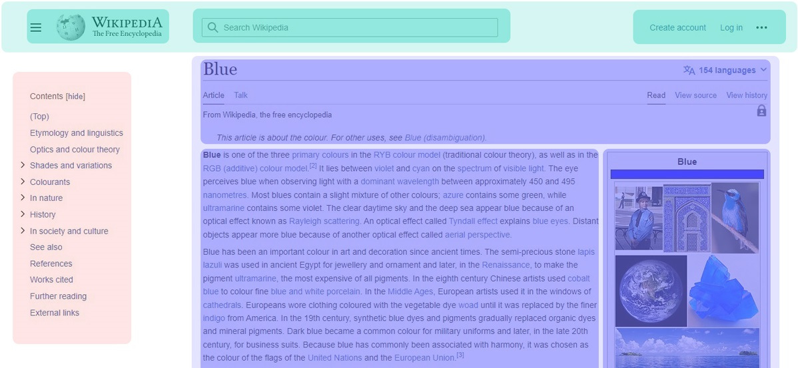
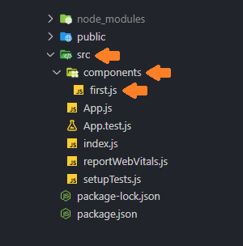
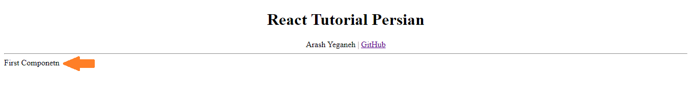
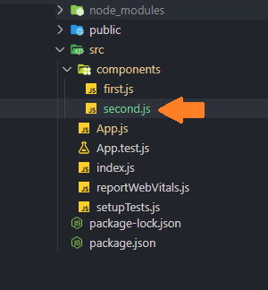
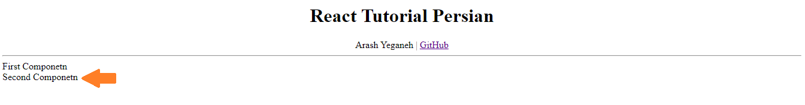

# فصل 3. کامپوننت چیست؟ `What is Component`

رابط گرافیکی `UI` هر اپلیکیشن به بخش های کوچکتری به نام `Component` تقسیم می شوند که شامل ویژگی های ذیل می باشد:

* کامپوننت از JSX, استایل و دستورات جاوااسکریپتی که رفتار عناصر مشخص می کند تشکیل شده است.
* هر کامپوننت می تواند زیر مجموعه کامپوننت دیگر باشد. `nested`



در این مثال سه component به رنگ های سبز، قرمز، بنفش داریم که درون هر بخش چند component تعریف شده است.

> سایت `Wikipedia` صرفا جهت توضیح مفاهیم ذکر شده.

## روش های تعریف Component

در React به دو روش امکان تعریف Component وجود دارد:

<h3 dir="rtl">
    1. Functional Component
</h3>

تابعی که در این روش تعریف می شود باید دارای ویژگی های ذیل باشد:

* در آرگومان مقدار `props` دریافت کند.
* باید عنصری از جنس ری اکت `react element` برگشت دهد.

```react
function Welcome(){
    return <h1>Hello</h1>
}

// ECMA Script 6
//const Welcome = () => <h1>Hello</h1>

export default Welcome;
```

<h3 dir="rtl">
     2. Class component
</h3>

مفهوم `class` از نسخه `ES6` به جاوا اسکریپت اضافه شده است. `class` تعریف شده باید دارای ویژگی های ذیل باشد:

* مشتق شده از `React.Compo` باشد.
* تابع `render` درون کلاس تعریف شود.
* تابع `render` باید عنصری از جنس ری اکت `react element` برگشت دهد.

```react
import { Component } from "react";

class Welcome extends Component {
	render(){
		return <h1>Hello</h1>;
	}
}

export default Welcome;
```

## مناسب ترین روش تعریف کامپوننت؟

اگر تمایل به برنامه نویسی شیء گرایی `object-oriented programming` دارید یا نیاز به استفاده از `lifecycle ` را دارید مجبور به استفاده از ساختار `Class component` هستید، در غیر اینصورت روش `Functional component` به دلیل سادگی در برنامه نویسی محبوبیت بیشتری دارد.

## رندرینگ

به صورت پیش فرض عنصر `div` با مقدار id برابر با `root` در فایل `index.html` ساخته می شود.

```html
<div id="root"></div>
```

برای اینکه component ها را از این پس درون این عنصر ساخته شود، کافیست با استفاده از تابع `()ReactDOM.createRoot` این عنصر را تعریف کنیم.

```react
const root = ReactDOM.createRoot(
  document.getElementById('root')
);
```

برای رندر component ها در عنصر `root` از متد `()render` استفاده می کنیم.

```react
const root = ReactDOM.createRoot(
  document.getElementById('root')
);
const element = <h1>Hello, world</h1>;
root.render(element);
```

## تعریف `Component`

برای فراخوانی `component` درون jsx به دو روش امکان پذیر می باشد:

* تگ واحد `self-closing`

  ```react
  import ExampleComponent from './components/ExampleComponent'
  
  <ExampleComponent />
  ```

* تگ جفتی `non self-closing`

  ```react
  import ExampleComponent from './components/ExampleComponent'
  
  <ExampleComponent> </ExampleComponent>
  ```

> 💡 تفاوت این 2 روش در فصل های آینده توضیح داده می شود.

<h3 dir="rtl">
    Functional Component
</h3>

فولدری به نام `components` درون فولدر `src` تعریف می کنیم سپس فایلی به نام `first.js` ایجاد می کنیم.



درون فایل `first.js` دستورات ذیل وارد می کنیم

```javascript
function First() {
    return <>First Componetn</>
}

export default First;
```

تابع `First` متنی در قالب jsx برگشت می دهد. مرحله بعد باید این `component` را در مکان موردنظر فراخوانی کنیم.

در فایل `App.js` دستورات ذیل وارد می کنیم.

(خط 1) `component` ساخته شده را فراخوانی می کنیم.

(خط 13) سپس مقدار `First` را به یکی از 2 روش `self-closing` یا `non self-closing` فراخوانی می کنیم.

```react
import First from './components/first'

function App() {
  return (
    <>
      <div align="center">
        <h1>React Tutorial Persian</h1>
        <span>Arash Yeganeh</span>
        <i style={{ 'margin': '0 0.2rem' }}>|</i>
        <a href="https://github.com/arashyeganeh/React-Tutorial-Persian" rel="noreferrer" target='_blank'>GitHub</a>
        <hr />
      </div>
      <First /> { /* Or <First> </First> */ }
    </>
  );
}

export default App;
```



📁 [مشاهده پروژه](/react_basic/Chapter3.Component/project)

<h3 dir="rtl">
     Class Component
</h3>

فولدری به نام `components` درون فولدر `src` تعریف می کنیم سپس فایلی به نام `second.js` ایجاد می کنیم.



در فایل `second.js` کلاسی به نام `Second` تعریف می کنیم که باید دارای شرایط ذیل باشد:

* باید کلاس `Component` از کتابخانه `react` فراخوانی کنیم.
* کلاس باید مشتق شده از `Component` باشد.
* در کلاس برای برگشت مقدار jsx  باید از متد `render` استفاده کنیم.

```react
import { Component } from 'react';

class Second extends Component {

    render() {
        return <>Second Componetn</>
    }
}

export default Second;
```

مرحله بعد باید این `component` را در مکان موردنظر فراخوانی کنیم. در فایل `App.js` دستورات ذیل وارد می کنیم.

(خط 2) `component` ساخته شده را فراخوانی می کنیم.

(خط 16) سپس مقدار `First` را به یکی از 2 روش `self-closing` یا `non self-closing` فراخوانی می کنیم.

```react
import First from './components/first'
import Second from './components/second'

function App() {
  return (
    <>
      <div align="center">
        <h1>React Tutorial Persian</h1>
        <span>Arash Yeganeh</span>
        <i style={{ 'margin': '0 0.2rem' }}>|</i>
        <a href="https://github.com/arashyeganeh/React-Tutorial-Persian" rel="noreferrer" target='_blank'>GitHub</a>
        <hr />
      </div>
      <First /> { /* Or <First> </First> */}
      <br />
      <Second> </Second> { /* Or <Second /> */}
    </>
  );
}

export default App;
```



📁 [مشاهده پروژه](/react_basic/Chapter3.Component/project)
